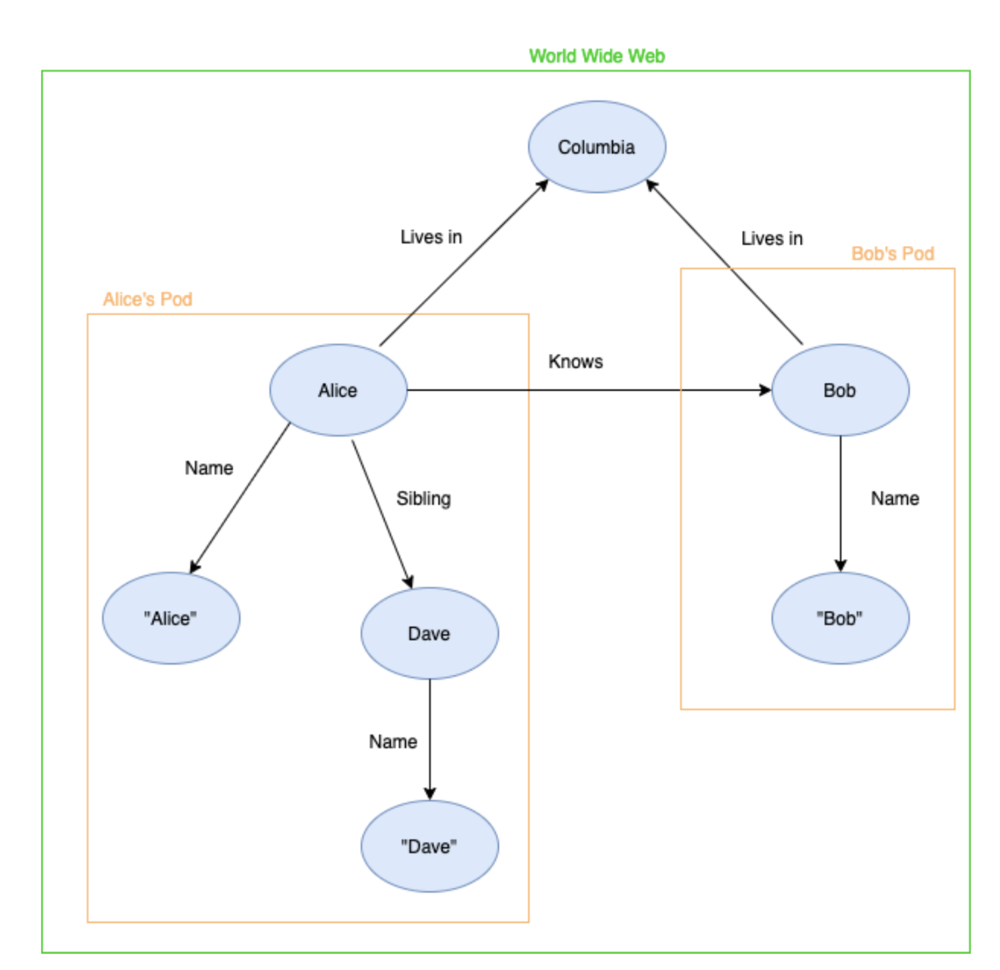

## Linked Data

One of the most critical aspects of the semantic web is creating links between the data. 
These links do not only allow humans to traverse the web, but they provide a simple way for machines to traverse the web as well, and are described in a standardized framework called RDF.

Four rules need to be followed to speak of linked data citation needed: 

1. Objects have to be identified through a unique resource identifier (URI).
2. These URIs have to be HTTP URIs.
3. Data has to be found when we follow such a URI. This data can be formatted in many ways, such as RDF or XML. rdf is a framework, not a format, which can be serialized using formats such as XML. but the guidelines just say information must be returned using a standard, _such as_ RDF
4. The data has to include links to other data. These links are vital to create a 'web' of data.
An easy way to represent linked data is by using a directed graph. Figure  is an example of such a graph. 
The vertices represent objects or data points, while the edges represent the links objects contain to other objects or data points.
For example, in figure  we can see an object Alice has a link called 'knows' to Bob. 
This link looks like (Alice, 'knows', Bob) in an RDF triple, where Alice and Bob would be the respective URIs of these data points. No need to refer to the same figure twice
Alice also has a link called 'Name' to a data point with the value "Alice".  
It can be noticed that every object has at least one link, which will guarantee a 'web' of data.

<figure id="LinkedData">

<figcaption markdown="block">
Example of a linked data web if this is the image you want to use, you'll have to explain what a pod is

</figcaption>
</figure>
