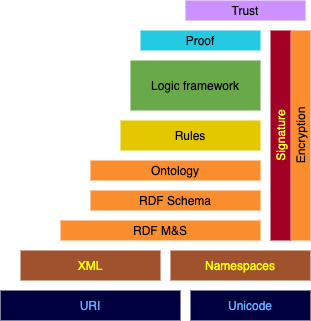

## Semantic Web
The term _''Semantic Web''_ was first introduced by Tim Berners-Lee in 2001 . The Semantic Web is created to solve the main problem of the Web, being that the Web is readable for humans, but not for machines. With the Semantic Web, machines should be able to interprete the Web. These machines are called intelligent agents and they will be able to fulfill complex tasks autonomously. 

To achieve this goal, a preliminary step is that publishers of data must be able to assign a meaning to the elements of the dataset. More specifically, machines must be able to understand this meaning without human intervention. Since datasets can have a variety of natures and topics, there is a need for so-called *ontologies*, which can be compared to vocabularies for humans. However, vocabularies define terms and ontologies define how these terms are related, mostly for reasoning. Finally, the Semantic Web must be *decentralized*, which means that data should not be contained on a single or a few servers . 

### Semantic Web Stack

The architecture of the Semantic Web is based on a hierarchy of technologies. In this hierarchy, each layer uses the layer beneath it in the hierarchy to achieve its goal. This strategy is visualized in . The subject of this paper is the publishing of data, so only the layers that are relevant to this will be discussed. This is pretty much everything up untill rules.

<figure id="semanticstack">

<figcaption markdown="block">
Semantic Web Stack (based on ). This image reflects the original Semantic Web Stack from 2001. As a result, some of the technologies are outdated or deprecated (e.g. URI and XML).
</figcaption>
</figure>

#### Unicode
{:#unicode}

Unicode [^unicodespec] is a system that is used for consistent encoding, representation and handling of text. Similar to ASCII, Unicode was established to aid developers in the creation of applications. However, the advantage of Unicode is that it solves the problems that exist in previous encoding schemes, such as the inability to encode all characters. This problem in particular is tackled by assigning a identifier to each character on every platform, for every program and in every language .

[^unicodespec]: https://unicode.org/standard/standard.html

Unicode is at the base of the Semantic Web Stack, because it was a W3C recommendation for the Web in general. 

#### Uniform Resource Identifier (URI)

A URI offers a uniform way to identify an object. This identifier is often confused with a *Uniform Resource Locator (URL)*, which *locates* an object, rather than *identifying* it. Consequently, every URL is an example of a URI, but the opposite is not true [^urispec].

[^urispec]: https://www.w3.org/Addressing/URL/uri-spec.html

Together with Unicode, URI forms the foundations of the Semantic Web Stack. This combination enables the identification of resources on the Web in a uniform manner.

#### Extensible Markup Language (XML)

XML is used to describe data. One of the most important characteristics of XML is its ability of structuring data in a flexible way. XML defines elements using so-called ``tags'', with every element having both a start-tag and an end-tag. Furthermore, XML supports nested elements, enabling the creation of hierarchies. XML is important because of its simplicity and extensibility. XML is at the lower part of the Semantic Web Stack because it was a W3C recommendation.

#### Resource Description Framework (RDF) Model, Syntax and Schema

The final element of the Semantic Web Stack is RDF, which is used to add meta-information to a dataset in a describing way. Due to the importance of RDF for the rest of this paper, it is explained in detail in [RDF](#formatting-RDF).